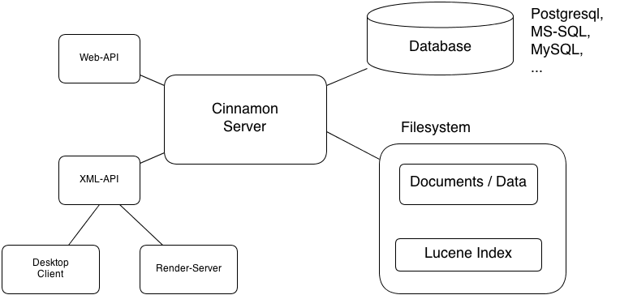

# Cinnamon ECMS Server Architecture

The Cinnamon 2 is a Java servlet, which runs inside a web application server like Apache Tomcat.

The servlet offers a stable XML API for the desktop client (and a web client which is still under construction).

User created data is stored in the file system, along with the index data generated by the Lucene-based indexer.
The objects, folders, all system and custom metadata etc are stored in an RDBMS (which can be any database for which
there is sufficient Hibernate support, for example Postgresql, MySQL, MS SQLserver etc).

## Resources

The default Cinnamon installation only requires modest resources.

* About 1 GByte of RAM, 4 GByte or more recommended
* Less than 500 MByte for the base system (Server, RDBMS, Java)
* Linux or Windows OS, may run on Mac OS

## Extensiblity

The server API is plugin-friendly, that is: a developer can create additional classes which can be inserted
in several places:

* API extensions: offer new commands for the client to call upon, for example the translation capabilities are
  added to the base API via an extension class.
* ChangeTrigger: commands can be enhanced with trigger classes which are executed before and / or after the command
  is called by the client. A change trigger can filter the response or add further custom data to it.
* Resolver: Objects may have relations to other objects, for example a HTML document often has references to images
  which are also stored in the Cinnamon repository. When the user exports the document, a resolver checks which
  version of the related object should be exported along with it.
* Indexer: You can add classes which perform additional parsing or decoding of content objects, the results
  of which can be added to the Lucene index documents. For example, you could create an indexer which performs OCR
  on scanned images and stores the result in a the object's metadata so it can be searched for.
* Lifecycles: By adding additonal Lifecycle classes, you can control the consequences of changes made to an object's
  lifecycle state. For example, if a PDF enters a 'published' state, you could have the Lifecycle class send it to
  the archive or a web server for publishing.
* Workflow transitions: the transition from one workflow state to another is controlled by transition classes.
  This allows you to create completely new behaviors for workflows.

