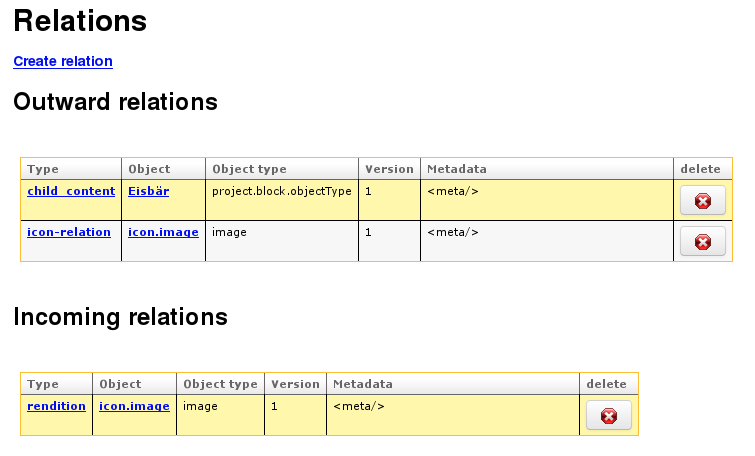
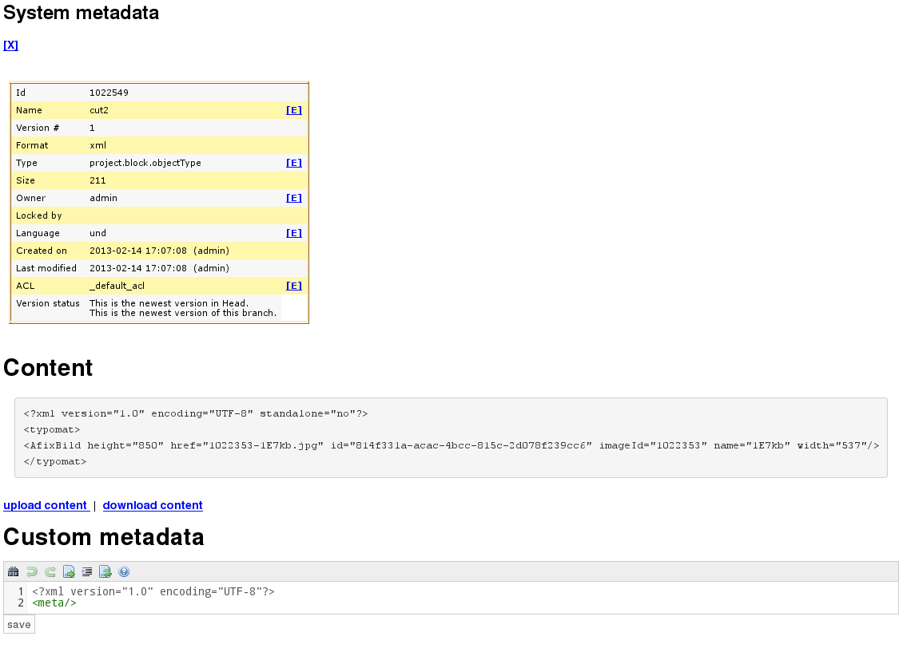

# Webclient features

The webclient is still work in progress, but already offers several interesting features:

* Lucene search: searching a million objects takes less than a second (delivery of search results depends 
  on database and browser speed - rendering 10 objects in the browser is near instantaneous,
  but loading a thousand objects from the database will of course take some time)
* extendable: it's a Grails plugin, so you can use it in your own projects to integrate powerful CMS features easily.
* automatic thumbnail generation
* versioning: you can select to browse only the newest versions or view al versions of an object.
  And you can easily version any object to create branches.
* relations: you can create typed relations between objects (for example, renditions to link a PDF to a DOC object,
  or child-relations to link an image to its HTML parent document). Relations allow you to see where an object is used
  as well as protect objects from deletion that are still required by another document.
* download complete folders as ZIP archives
* assign customized ACLs to handle permissions for user groups
* cross-folder selection: like adding items to a shopping cart, you can select folders and documents from
  multiple places and cut / copy / move them.

## Business features

* Open Source with Apache 2.0 License - free to use in commercial and non-commercial settings
* No license fees
* No obligatory support contracts - but commercial support is available (see: [Cinnamon website](http://cinnamon-cms.de)) .
* Unlimited number of clients and repositories (meaning you can create as many user accounts and database repositories 
  as you like - system performance is of course dependent on hardware capabilities)

## Screenshots

