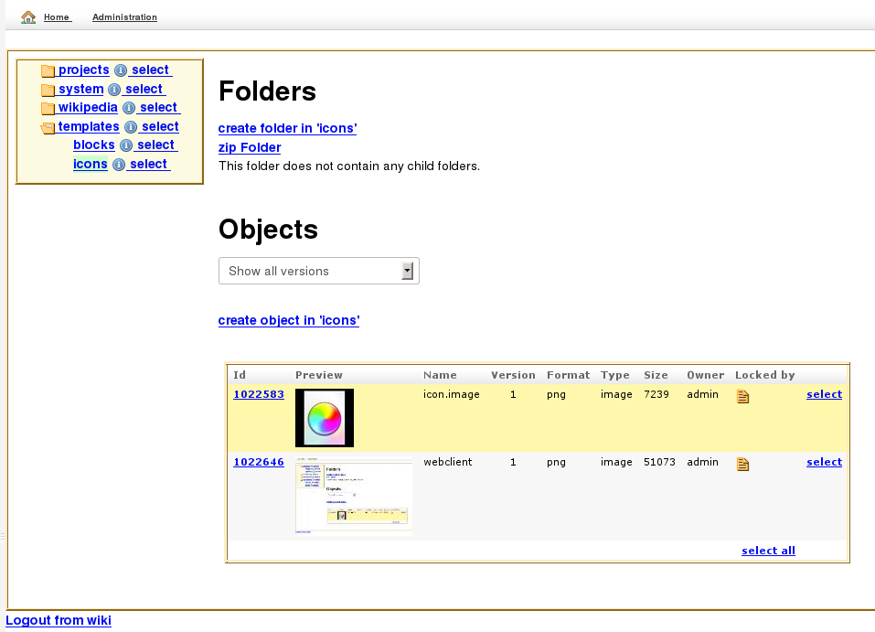

# Cinnamon Webclient

Cinnamon webclient supports most, but not all of the functionality of Cinnamon Desktop Client,
while at the same time being portable to any machine with one of the common web browsers installed. 
Therefore, it is the right choice for applications on various platforms (like Mac or Linux), 
for part-time users, for mobile use and for less complex operations, including review and approval, 
editing of unmodular data (like word processor documents or spreadsheets). 
Like the desktop client, the webclient is highly extensible and can be custom-tailored to your exact business needs.

## History

Traditionally, the Cinnamon CMS is used via a standalone application, the desktop client.
But as the desktop client is a .NET application using advanced language features
currently not covered by Mono, this means there is no Linux desktop client at the moment.

As Dandelion, the Cinnamon Administration Tool was already a Grails application, it was
soon decided to add a sister application in the form of the Illicium web client to the list
of Cinnamon clients. But as most customers already relied on the desktop client to their
full satisfaction, the web client project had a rather low priority.

This changed with the advent of Cinnamon 3, a partial rewrite and conversion from a
hand-crafted servlet to a modern web framework architecture in the form of a large
Grails plugin / application. Though still under heavy development, the Cinnamon 3 
webclient already offers a good view of what is to come.

## Architecture

The webclient requires a login to a specific repository. Once the user is authenticated,
he can browse the repository and interact with the server. So one Cinnamon server can be
used to access multiple repositories (databases which contain the user's documents and other data) 
via a single web frontend, but you withhin a session you are currently limited to 
a single repository. You may open more than one browser tab for this repository, though.
The desktop client in contrasts allows you to establish multiple sessions to the same or
different repositories (for example, logging in as an administrator in addition to an ongoing
user session).

* The server is a [Grails application](http://grails.org)
* [jQuery](http://jquery.org) is used as the default JavaScript library.
* [CodeMirror](http://codemirror.net/) is used to render XML configuration objects.

## Installation

The Cinnamon 3 webclient is supplied out-of-the box with the Cinnamon server.
Just install the cinnamon.war into your favorite application server according to the
documentation and you are good to go.

## Screenshots

